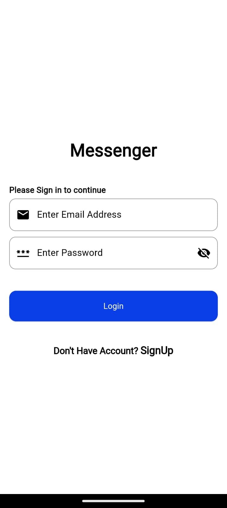
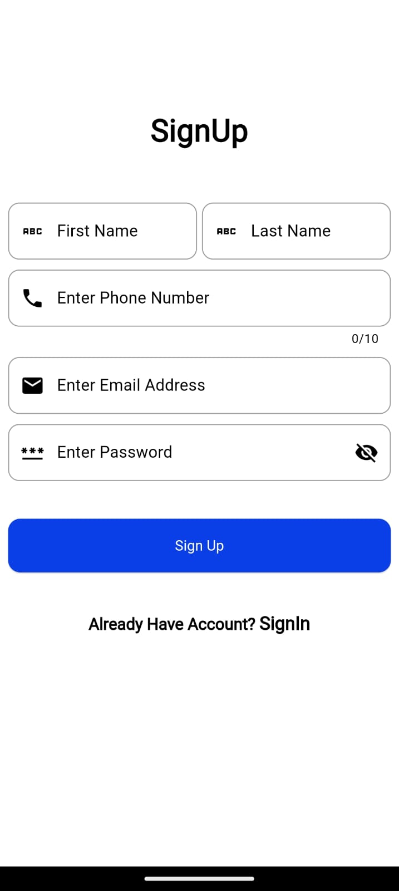
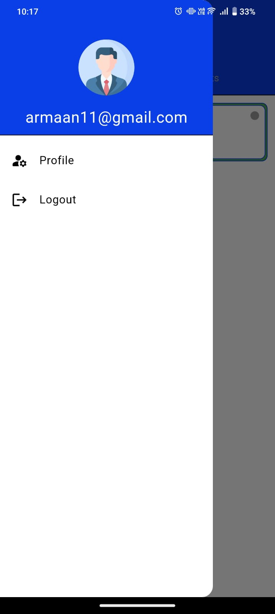
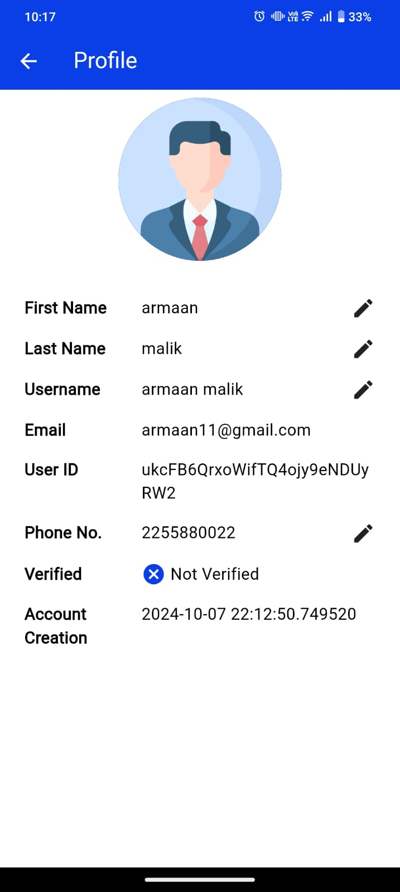
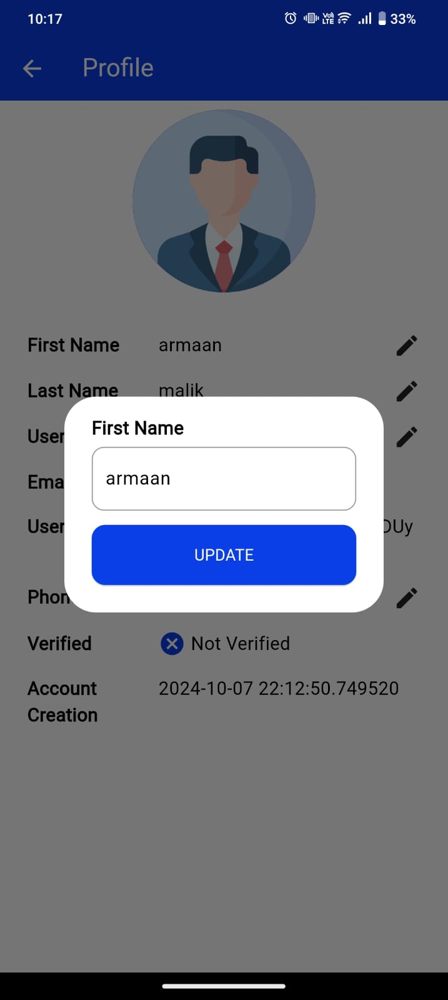
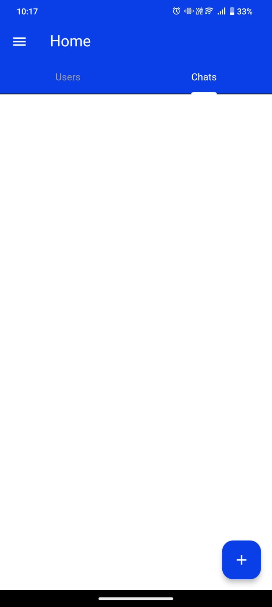
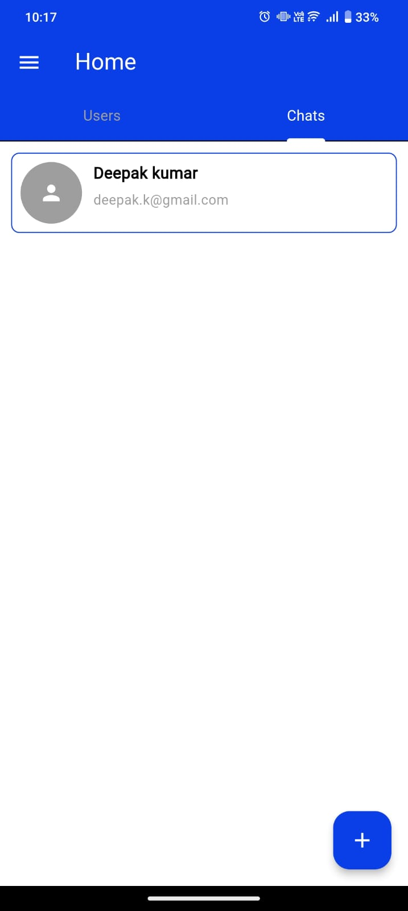
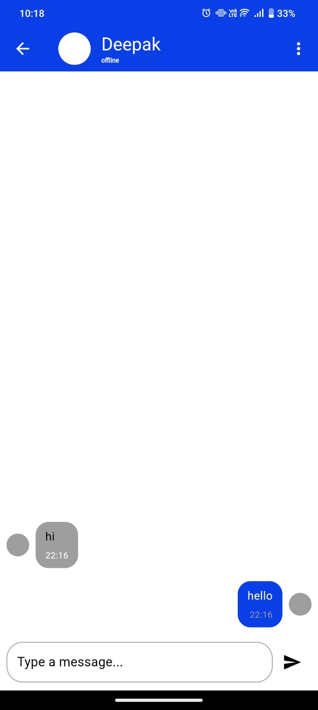
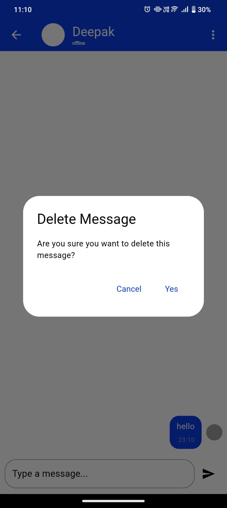
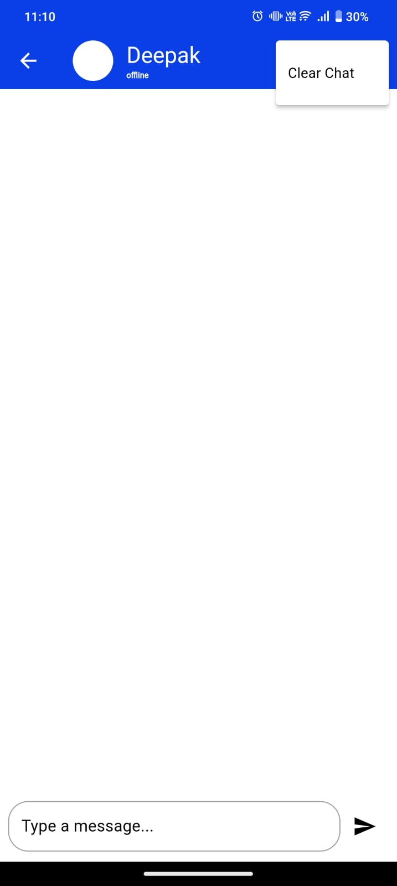

# Signwalla

Signwalla is a chat application built with Flutter.

## Getting Started

This project is a starting point for a Flutter application.

You can download the APK from [here](assets/apk-file/app-release.apk).


### Prerequisites

Before running this project, make sure you have Flutter installed on your system. If you haven't already, you can download it from the [Flutter website](https://flutter.dev/docs/get-started/install).

### Setup Instructions

To get started with the project, follow these steps:

1. **Clean the project**:
   ```bash
   flutter clean
   ```

2. **Install the dependencies**:
   ```bash
   flutter pub get
   ```

3. **Run the app**:
   ```bash
   flutter run
   ```

This will launch the app on your connected device or emulator.

## Screenshots

### Splash Screen


### Login Screen


### Signup Screen


### Home Screen


### Drawer Screen


### Profile Screen


### Update Profile Screen


### Users Screen


### Chat List Screen


### Selected Users Screen


### Chating Screen


### Delete Message


### Clear Chat



